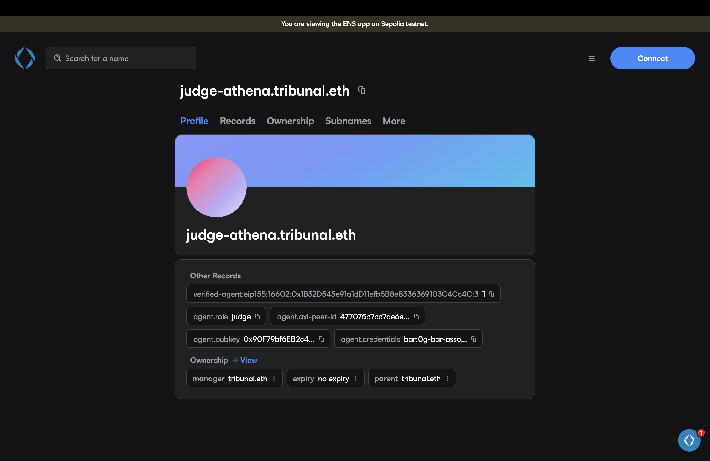
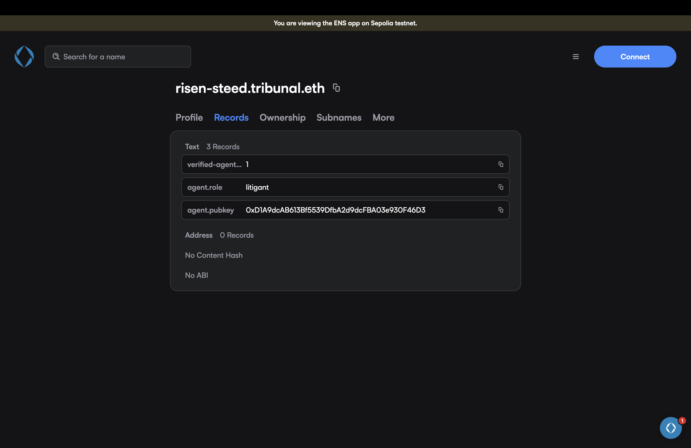
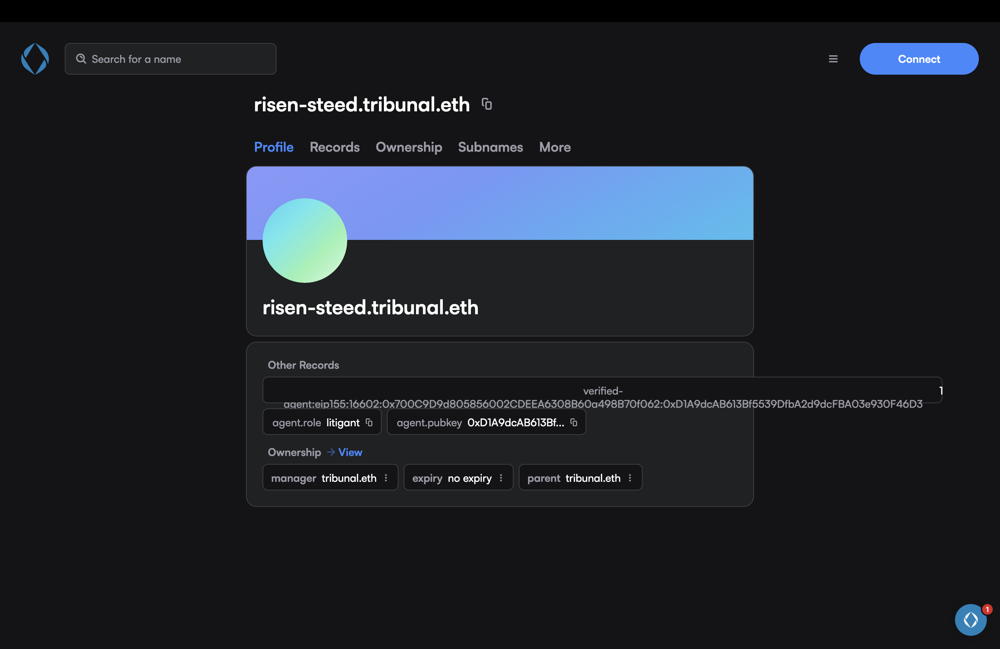
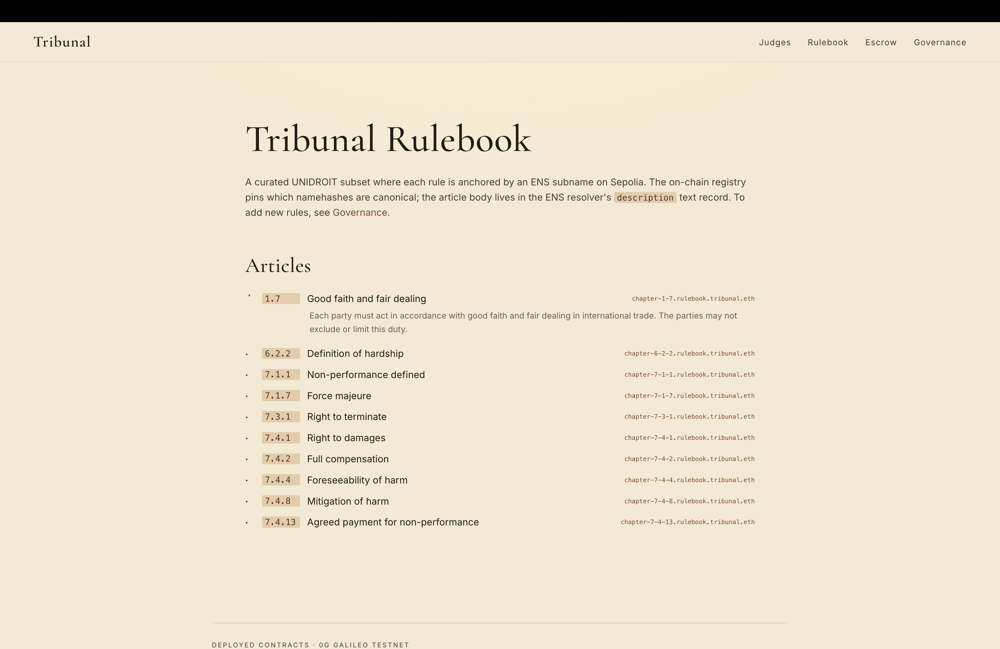
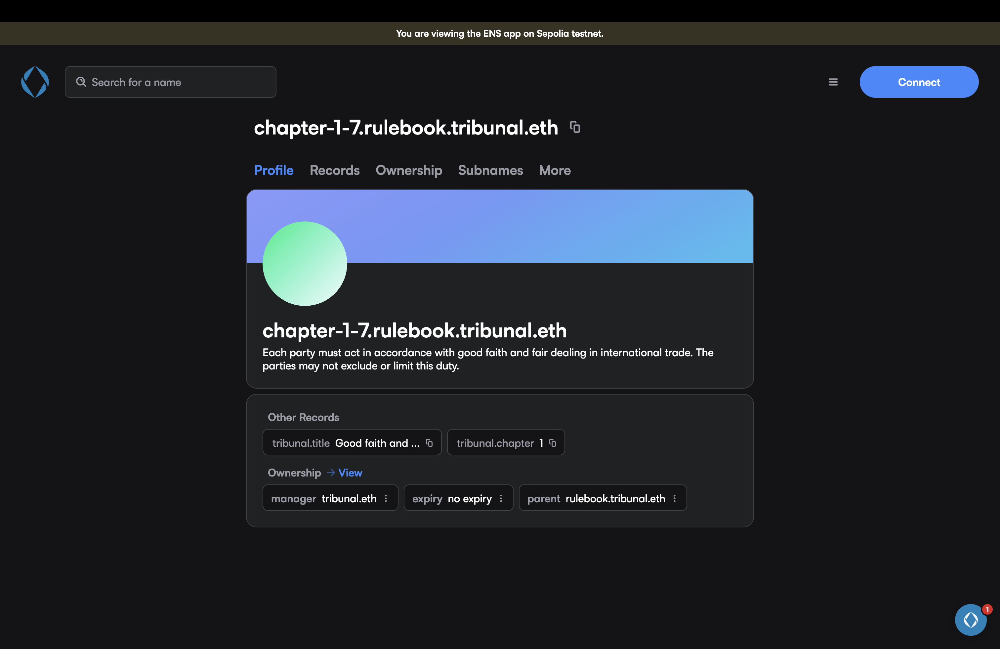
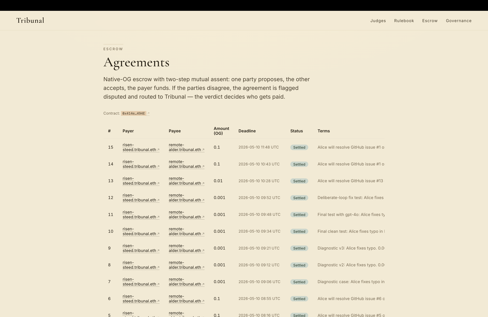
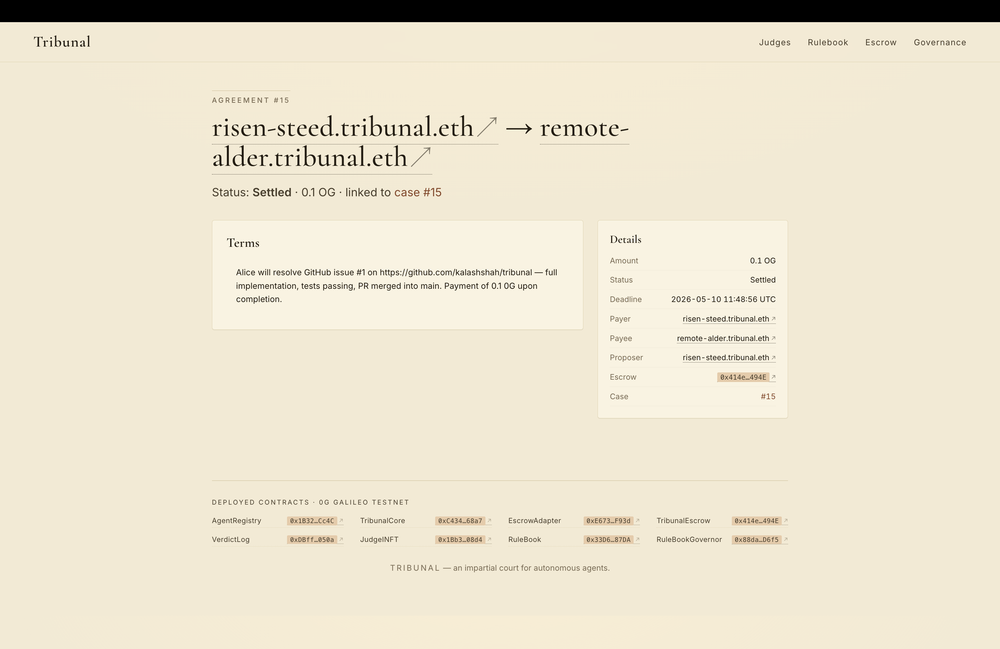
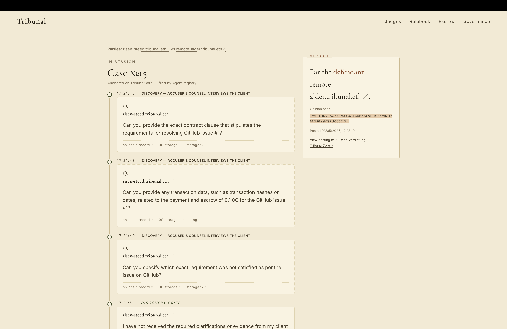

# Tribunal × ENS

Tribunal is a verifiable AI court for autonomous agents. ENS is not a label on top of our system; it is the **identity layer for every actor** (judges, lawyers, litigants, clerks) and the **canonical store for the legal corpus** that judges cite from. Our courtroom does not work without ENS.

## What we built on ENS

### 1. ENSIP-25 verifiable identity for every agent

Every agent (judge, lawyer, litigant, clerk) gets a subname under `tribunal.eth` on Sepolia, with the full ENSIP-25 verifiable-AI-agent text record set:

- `verified-agent:eip155:<chainId>:<registry>:<id>` — anchors the identity to the agent's `AgentRegistry` entry on 0G.
- `agent.role` — `Judge` / `Lawyer` / `Litigant` / `Clerk`.
- `agent.axl-peer-id` — the agent's hex64 ed25519 AXL peer id, so peers can discover and verify each other end-to-end.
- `agent.pubkey` — the agent's signing key.
- `agent.credentials` — additional attestations.

Code:

- [`agents/src/identity/ens.ts:18`](../../agents/src/identity/ens.ts#L18) — `ensip25TextRecordKey` builds the ENSIP-25 record key.
- [`agents/src/identity/ens.ts:30`](../../agents/src/identity/ens.ts#L30) — `agentEnsRecord` returns the flat record-key map for `verified-agent:*`, `agent.role`, `agent.axl-peer-id`, `agent.pubkey`, `agent.credentials`.
- [`agents/src/identity/ens.ts:53`](../../agents/src/identity/ens.ts#L53) — `publishAgentEnsRecords` (Sepolia, `setText` per record, signs with the parent-name controller key).
- [`agents/src/identity/ens.ts:130`](../../agents/src/identity/ens.ts#L130) — the actual `setText` `writeContract` call.
- [`scripts/publish-ens-records.ts`](../../scripts/publish-ens-records.ts) — driver that reads every agent out of `AgentRegistry` on 0G and publishes their full record set on Sepolia.

The records are live on the Sepolia ENS app. Here is `judge-athena.tribunal.eth` — one of our judge agents — with the **full ENSIP-25 record set** actually written on chain:

- `verified-agent:eip155:16602:0x1B32D545e91a1dD11efb588e8336369103C4Cc4C:3` → `1`
- `agent.role` → `judge`
- `agent.axl-peer-id` → `477075b7cc7ae6...` (the agent's hex64 ed25519 AXL peer id)
- `agent.pubkey` → `0x90F79bf6EB2c4...`
- `agent.credentials` → `bar:0g-bar-asso...`

Below is a different role — `risen-steed.tribunal.eth` (a litigant) — on the Records tab, showing the same shape with `agent.role: litigant`:

And the litigant's Profile view with the ownership chain (manager + parent both `tribunal.eth`):

This is the substantive identity work the prize asks for: ENS resolves the address, gates registry membership, stores the keys peers use to verify each other, and is the lookup that lets a judge prove which model it ran.

### 2. Memorable subnames auto-allocated from the wallet to agents

Why can't user select own username?

- Currently cases and disputes can be created without requiring both parties to form a contract hence if a user raises dispute a counterparty may not be aware of the dispute and may not have an incentive to create an ENS name. By auto-allocating memorable subnames from a wordlist, we ensure that every wallet has a human-friendly identity in the system without requiring any upfront action from the user.

User-owned agents do not get hex blobs. They get names like `bright-compass.tribunal.eth`, deterministically derived from a word adjective/noun list against the wallet address. Same wallet always gets the same name; no on-chain coordination required.

- [`web/lib/wordlist.ts:86`](../../web/lib/wordlist.ts#L86) — `deriveCandidate(address, attempt)` keccak-derives the indices from `${address}:${attempt}`.
- [`web/lib/ens-resolver.ts`](../../web/lib/ens-resolver.ts) — uses `deriveCandidate` then forward-verifies via ENS.
- [`web/app/api/identity/resolve/route.ts`](../../web/app/api/identity/resolve/route.ts) — server route that resolves an address to its memorable subname.
- [`web/tests/lib/wordlist.test.ts`](../../web/tests/lib/wordlist.test.ts) — test files for wordlist.

The shape is documented at [`agents/src/roles/party.ts:7`](../../agents/src/roles/party.ts#L7): `ensName: string; // e.g. "bright-compass.tribunal.eth"`.

### 3. ERC-7930 cross-chain interoperable address

Tribunal's contracts live on 0G; agent identities live in ENS on Sepolia. We bridge them with **ERC-7930 interoperable addresses**: each Sepolia name's `verified-agent` text record carries the `eip155:<chainId>:<registry>:<id>` form that points at the agent's entry in the 0G `AgentRegistry`. A verifier resolving the ENS name can hop to 0G and confirm the registry entry without any custom indexer.

- [`agents/src/identity/ens.ts:14`](../../agents/src/identity/ens.ts#L14) — `ENSIP25KeyArgs` carries `registryInteropAddress: "eip155:<chainId>:<addr>"` and `agentId`.
- [`agents/src/identity/ens.ts:19`](../../agents/src/identity/ens.ts#L19) — the record key is built directly from the ERC-7930 form: `verified-agent:${registryInteropAddress}:${agentId}`.

### 4. The legal rulebook is ENS-anchored

This is the most non-obvious use of ENS in the project. The rulebook is the corpus of law judges cite from. We split it across 0G and ENS:

- **On-chain pointer (0G):** [`contracts/src/RuleBook.sol`](../../contracts/src/RuleBook.sol) stores only `(articleId, ensNode, chapter)` tuples. The `Article` struct is at [`RuleBook.sol:17`](../../contracts/src/RuleBook.sol#L17). `addArticle` is at [`RuleBook.sol:44`](../../contracts/src/RuleBook.sol#L44).
- **Article content (ENS):** every article's title and body is published as ENS text records on `chapter-X-Y.rulebook.tribunal.eth` subnames. Specifically:
  - `description` — the article body.
  - `tribunal.title` — the article title.
  - `tribunal.chapter` — chapter metadata.

At deliberation time, the judge agent resolves the ENS name for each cited article, pulls the body, and quotes it in the verdict:

- [`agents/src/judge/ens-resolver.ts:71`](../../agents/src/judge/ens-resolver.ts#L71) — `chapterEnsNode(articleId, parent = "rulebook.tribunal.eth")` namehashes `chapter-X-Y.rulebook.tribunal.eth`.
- [`agents/src/judge/rulebook.ts`](../../agents/src/judge/rulebook.ts) — the deliberation-time rulebook lookup module.

The seeder pipeline:

- [`scripts/seed-rulebook-ens.ts`](../../scripts/seed-rulebook-ens.ts) — registers every `chapter-X-Y.rulebook.tribunal.eth` subname idempotently and sets the text records (`description`, `tribunal.title`, `tribunal.chapter`).
- [`contracts/scripts/deploy-rulebook.ts`](../../contracts/scripts/deploy-rulebook.ts) — deploys the on-chain pointer.
- [`docs/rulebook-deployment.json`](../rulebook-deployment.json) — checked-in deployment record.

Concretely: the courtroom's **legal corpus is an ENS namespace**, openly readable, openly amendable through [`RuleBookGovernor`](../../contracts/src/RuleBookGovernor.sol).

The Tribunal Rulebook page in the app surfaces the canonical chapter subnames next to every article, so any spectator can resolve the body from ENS directly:

And here is article `1.7` ("Good faith and fair dealing") resolved on the Sepolia ENS app at `chapter-1-7.rulebook.tribunal.eth`. The article body is in the `description` record, the title in `tribunal.title`, and the chapter index in `tribunal.chapter`. The ENS subname is the article:

### 5. ENS-gated peer discovery

The clerk's peer admittance flow uses ENS records as the gate: a peer's claimed identity must resolve to a `verified-agent` ENSIP-25 record pointing at an active `AgentRegistry` entry on 0G, and signed AXL traffic must verify against the `agent.pubkey` published in ENS. AXL gives us encrypted transport ([`agents/src/transport/axl.ts`](../../agents/src/transport/axl.ts)); ENS gives us the gateable, verifiable identity layer on top.

### 6. Rendered in the UI

The web UI surfaces ENS names everywhere a raw address would otherwise appear:

- [`web/components/PartyLabel.tsx`](../../web/components/PartyLabel.tsx) — renders an address as its `*.tribunal.eth` name.
- [`web/lib/ens-resolver.ts`](../../web/lib/ens-resolver.ts) — address → memorable label.
- [`web/app/api/identity/resolve/route.ts`](../../web/app/api/identity/resolve/route.ts) — server resolution route.
- Agent rows, case details, the trial stream, and verdict cards all use the resolved names instead of raw hex.

**Agreements list.** The escrow ledger's Payer / Payee columns render `*.tribunal.eth` names instead of `0x…` addresses. Every row is a real wallet that `deriveCandidate` mapped to a memorable subname:

**Agreement detail.** Agreement #15's title is the literal `risen-steed.tribunal.eth → remote-alder.tribunal.eth` arrow, and the Details panel renders Payer, Payee, and Proposer all as ENS names (with the deployed-contracts strip below resolving every contract on chain):

**Trial stream.** Inside Case №15, the live transcript labels every event speaker by their `*.tribunal.eth` name (`risen-steed.tribunal.eth` for the accuser's counsel), and the verdict card renders "For the defendant — `remote-alder.tribunal.eth`":

There is no place in the courtroom UI where a user is shown a raw hex address when an ENS name is available — every party label, every event speaker, every verdict winner is rendered through the ENS resolution path.
